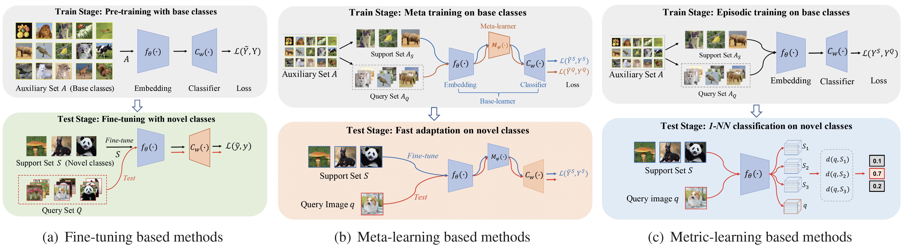

# [LibFewShot](https://arxiv.org/abs/2109.04898)
Make few-shot learning easy.

[LibFewShot: A Comprehensive Library for Few-shot Learning](https://www.computer.org/csdl/journal/tp/5555/01/10239698/1Qck3o85t60).
Wenbin Li, Ziyi Wang, Xuesong Yang, Chuanqi Dong, Pinzhuo Tian, Tiexin Qin, Jing Huo, Yinghuan Shi, Lei Wang, Yang Gao, Jiebo Luo. In TPAMI 2023.<br>


## Supported Methods
### Non-episodic methods (a.k.a Fine-tuning based methods)
+ [Baseline (ICLR 2019)](https://arxiv.org/abs/1904.04232)
+ [Baseline++ (ICLR 2019)](https://arxiv.org/abs/1904.04232)
+ [RFS (ECCV 2020)](https://arxiv.org/abs/2003.11539)
+ [SKD (BMVC 2021)](https://arxiv.org/abs/2006.09785)
+ [Negcos (ECCV 2020)](https://arxiv.org/abs/2003.12060)
+ [S2M2 (WACV 2020)](https://arxiv.org/abs/1907.12087)
### Meta-learning based methods
+ [MAML (ICML 2017)](https://arxiv.org/abs/1703.03400)
+ [Versa (NeurIPS 2018)](https://openreview.net/forum?id=HkxStoC5F7)
+ [R2D2 (ICLR 2019)](https://arxiv.org/abs/1805.08136)
+ [LEO (ICLR 2019)](https://arxiv.org/abs/1807.05960)
+ [MTL (CVPR 2019)](https://arxiv.org/abs/1812.02391)
+ [ANIL (ICLR 2020)](https://arxiv.org/abs/1909.09157)
+ [BOIL (ICLR 2021)](https://arxiv.org/abs/2008.08882)
### Metric-learning based methods
+ [ProtoNet (NeurIPS 2017)](https://arxiv.org/abs/1703.05175)
+ [RelationNet (CVPR 2018)](https://arxiv.org/abs/1711.06025)
+ [ConvaMNet (AAAI 2019)](https://ojs.aaai.org//index.php/AAAI/article/view/4885)
+ [DN4 (CVPR 2019)](https://arxiv.org/abs/1903.12290)
+ [CAN (NeurIPS 2019)](https://arxiv.org/abs/1910.07677)
+ [ATL-Net (IJCAI 2020)](https://www.ijcai.org/proceedings/2020/0100.pdf)
+ [ADM (IJCAI 2020)](https://arxiv.org/abs/2002.00153)
+ [FEAT (CVPR 2020)](http://arxiv.org/abs/1812.03664)
+ [RENet (ICCV 2021)](https://arxiv.org/abs/2108.09666)
+ [DeepBDC (CVPR 2022)](https://arxiv.org/abs/2204.04567)


## Quick Installation

Please refer to [install.md](https://libfewshot-en.readthedocs.io/en/latest/install.html)([安装](https://libfewshot-en.readthedocs.io/zh_CN/latest/install.html)) for installation.

Complete tutorials can be found at [document](https://libfewshot-en.readthedocs.io/en/latest/)([中文文档](https://libfewshot-en.readthedocs.io/zh_CN/latest/index.html)).

## Reproduction
We provide some validated configs in [reproduce](./reproduce/), please refer to `./reproduce/<Method_Name>/README.md` for further infomations. The meanings of the symbols are as follows:

> :book: The accuracies reproted by the papers.
>
> :computer: The accuracies reproted by ourselves.
>
> :arrow_down: Hyperlinks to download the checkpoints folder. (Containing `config.yaml`, `model_best.pth` and the `train/test log`)
>
> :clipboard: Hyperlinks to the config file.

You can also find these checkpoints at [model_zoo](https://drive.google.com/drive/u/1/folders/16DWKKqjzALoq4qb8LZQ6oELD9SGlYWe_).

## Datasets
[Caltech-UCSD Birds-200-2011](https://data.caltech.edu/records/20098), [Standford Cars](https://ai.stanford.edu/~jkrause/cars/car_dataset.html), [Standford Dogs](http://vision.stanford.edu/aditya86/ImageNetDogs/main.html), [*mini*ImageNet](https://arxiv.org/abs/1606.04080v2), [*tiered*ImageNet](https://arxiv.org/abs/1803.00676) and [WebCaricature](https://arxiv.org/abs/1703.03230) are available at [Google Drive](https://drive.google.com/drive/u/1/folders/1SEoARH5rADckI-_gZSQRkLclrunL-yb0) and [百度网盘(提取码：yr1w)](https://pan.baidu.com/s/1M3jFo2OI5GTOpytxgtO1qA).

## Contributing
Please feel free to contribute any kind of functions or enhancements, where the coding style follows PEP 8. Please kindly refer to [contributing.md](https://libfewshot-en.readthedocs.io/en/latest/contributing.html)([贡献代码](https://libfewshot-en.readthedocs.io/zh_CN/latest/contributing.html)) for the contributing guidelines.

## License
This project is licensed under the MIT License. See LICENSE for more details.

## Acknowledgement
LibFewShot is an open source project designed to help few-shot learning researchers quickly understand the classic methods and code structures. We welcome other contributors to use this framework to implement their own or other impressive methods and add them to LibFewShot. This library can only be used for academic research. We welcome any feedback during using LibFewShot and will try our best to continually improve the library.

## Citation
If you use this code for your research, please cite our paper.
```
@article{li2021LibFewShot,
title = {LibFewShot: A Comprehensive Library for Few-Shot Learning},
author={Li, Wenbin and Wang, Ziyi and Yang, Xuesong and Dong, Chuanqi and Tian, Pinzhuo and Qin, Tiexin and Huo Jing and Shi, Yinghuan and Wang, Lei and Gao, Yang and Luo, Jiebo},
journal = {IEEE Transactions on Pattern Analysis &amp; Machine Intelligence},
year = {2023},
number = {01},
issn = {1939-3539},
pages = {1-18}
}
```
